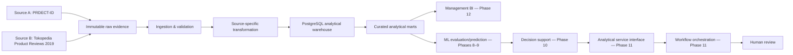

# MARKETVOICE SEA — SOLUTION ARCHITECTURE

**Phase:** 5 — Solution Architecture & Data Model  
**Version:** 1.0  
**Architecture state:** `DESIGN_ONLY`; Phase 6 is the first implementation phase.

## 1. System context

| Boundary participant | Role | Information exchanged |
|---|---|---|
| CX / management reviewer | Consumes source-aware customer-experience evidence. | Curated review/rating summaries and limitations. |
| Product-quality reviewer | Investigates Source B product review signals. | Product-level review intelligence with provenance. |
| Shop-review reviewer | Reviews bounded shop indicators. | Source B shop review indicators; no seller-performance claim. |
| Data-science / governance reviewer | Evaluates labels, model evidence, data quality, and lineage. | Benchmark/evaluation evidence, source limitations, audit information. |
| Human decision reviewer | Reviews proposed priority evidence. | Rationale, uncertainty, audit reference, and later human outcome. |
| Source A / Source B | Accepted analytical data sources. | Immutable raw review evidence only. |

MarketVoice owns the validated analytical representation and curated outputs. It does not own marketplace operations, customer identities, live marketplace integration, or enforcement decisions.

## 2. Component responsibilities

| Component | Requirement trace | Data owned / responsibility | Why it exists | Implementation phase |
|---|---|---|---|---|
| Data ingestion | `FR-001`, `NFR-005` | Registers accepted source files and immutable provenance references. | Creates reproducible entry to the analytical process. | 6 |
| Data validation | `FR-002`, `BR-007`, `NFR-001`–`NFR-003` | Validation findings, reconciliation evidence, privacy-review status. | Prevents unsupported or untraceable analytical input. | 6 |
| Source-specific transformation | `FR-001`, `DR-001`–`DR-004` | Consistent review representation while retaining source truth. | Enables analytics without cross-source fabrication. | 6 |
| PostgreSQL analytical warehouse | `FR-001`–`FR-006`, `NFR-001` | Track A core facts/dimensions and future output references. | Stores governed analytical entities and relationships. | 6 |
| Curated analytics layer | `FR-003`, `FR-005`, `FR-006`, `FR-009` | Source/category/product/shop analytical outputs. | Supplies BI-ready information without raw-file dependency. | 7 |
| ML layer | `FR-004`, `NFR-003` | Model/run evidence, predictions, evaluations; never source labels. | Supports reproducible Phase 8/9 research outputs. | 8–9 |
| Issue-intelligence layer | `FR-007` | Versioned taxonomy and review-issue result references. | Keeps future issue capability conditional and auditable. | 9 |
| Decision-support layer | `FR-008`, `NFR-004` | Decision rationale, uncertainty, rule version, human-review result. | Separates business decision support from model predictions. | 10 |
| Analytical service interface | `FR-009` | Curated analytical outputs exposed to approved consumers. | Defines service responsibility without prescribing endpoints. | 11 |
| Workflow orchestration | `NFR-004`, `NFR-006` | Future synthetic workflow references only. | Coordinates approved workflow actions; never performs model inference. | 11 |
| Management BI consumption layer | `FR-009`, `NFR-007` | Reads curated outputs and limitations. | Supports management/analytical consumption without raw CSV as final interface. | 12 |

## 3. Architecture principles and controls

- Source truth is immutable and distinct from transformations, predictions, and decisions.
- Source A and B remain independently traceable. No universal product key, fuzzy match, or temporal review fact exists.
- Model output never overwrites supplied rating, sentiment, or emotion values.
- Decision-support output references evidence but does not define Phase 10 score weights or thresholds.
- Track B is physically and semantically isolated from Track A, including any later operational event date.
- Secrets remain outside version-controlled configuration through `.env`-based handling; architecture requires no enterprise IAM system for this local prototype.
- Review text is subject to privacy review before exposure. No intentional PII enrichment or customer profiling is permitted.

## 4. Explicit deferrals

No executable DDL, ETL implementation, service endpoint, n8n workflow, Power BI visual/DAX, model architecture, issue taxonomy, priority formula, synthetic record, or temporal analytics design is defined in this phase.
