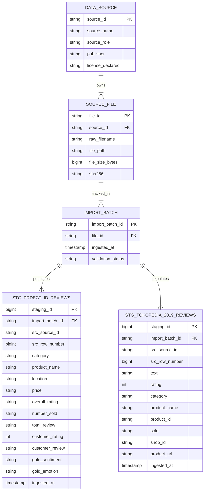

# MARKETVOICE SEA — PHASE 2 DATASET FORENSIC AUDIT REPORT

**Document Version**: 1.0 (Execution Report)  
**Execution Date**: 2026-08-10  
**Phase Target**: Phase 2 (Dataset Forensic Audit & Readiness Assessment)  
**Dual-Source Strategy**: Source A (`SRC_PRDECT_ID_V1`), Source B (`SRC_TOKOPEDIA_REVIEWS_2019`)  
**Dataset Acceptance Status**: `ACCEPTED`  

---

## 1. EXECUTION SUMMARY

In accordance with explicit user authorization and mandatory corrections, Phase 1–2 Data Foundation Remediation was executed in read-only forensic mode.

Both Source A (PRDECT-ID) and Source B (Tokopedia Product Reviews 2019) were acquired from canonical publisher repositories (Mendeley Data and Hugging Face), registered with SHA256 checksums, quarantined in separate raw subdirectories, and subjected to read-only forensic profiling.

Zero database DDL scripts, zero table imports, zero synthetic data records, zero ML training tasks, and zero remote Git write operations were executed.

---

## 2. SOURCE A VERIFICATION RESULT

- [PASS] **PRD-VER-01**: DOI `10.17632/574v66hf2v.1` verified on canonical Mendeley Data portal.
- [PASS] **PRD-VER-02**: Version 1 explicitly confirmed.
- [PASS] **PRD-VER-03**: Title *Product Reviews Dataset for Emotions Classification Tasks - Indonesian (PRDECT-ID) Dataset* verified.
- [PASS] **PRD-VER-04**: Mendeley API returned file metadata for `PRDECT-ID Dataset.csv` (File ID `f258d159-c678-42f1-9634-edf091a0b1f3`).
- [PASS] **PRD-VER-05**: License `CC BY 4.0` verified from canonical record.

---

## 3. SOURCE A DOWNLOAD RESULT

- **Source URL**: `https://data.mendeley.com/public-files/datasets/574v66hf2v/files/f258d159-c678-42f1-9634-edf091a0b1f3/file_downloaded`
- **Destination**: `data/raw/prdect_id/PRDECT-ID Dataset.csv`
- **Download Status**: `COMPLETED` (1,262,177 bytes transferred).
- **Encoding**: UTF-8 lossless.

---

## 4. SOURCE A CHECKSUM / MANIFEST

- **Source ID**: `SRC_PRDECT_ID_V1`
- **File Name**: `PRDECT-ID Dataset.csv`
- **File Size**: `1,262,177` bytes
- **SHA256**: `1dfdde6bb169ad57aab4211ecf45a75a4111b774ab43932f6d39c349bfd92bde`
- **Acquired At**: `2026-08-10T22:19:39`
- **License**: `CC BY 4.0` (`CANONICAL_MENDELEY_RECORD`)
- **Distribution Policy**: `LOCAL_ONLY`

---

## 5. SOURCE A ACTUAL SCHEMA

Empirical profiling of `data/raw/prdect_id/PRDECT-ID Dataset.csv`:

- **Shape**: 5,400 rows, 11 columns.
- **Physical Columns & Null Counts**:
  1. `Category`: 0 nulls (29 unique categories)
  2. `Product Name`: 0 nulls (2,713 unique titles)
  3. `Location`: 0 nulls (51 unique locations)
  4. `Price`: 0 nulls (e.g., Rp1.000)
  5. `Overall Rating`: 0 nulls (e.g., 4.9)
  6. `Number Sold`: 0 nulls (e.g., 100)
  7. `Total Review`: 0 nulls (e.g., 50)
  8. `Customer Rating`: 0 nulls (1, 2, 3, 4, 5 integer ratings)
  9. `Customer Review`: 0 nulls (5,400 text strings)
  10. `Sentiment`: 0 nulls (`Negative`: 2,821, `Positive`: 2,579)
  11. `Emotion`: 0 nulls (`Happy`: 1,770, `Sadness`: 1,202, `Fear`: 920, `Love`: 809, `Anger`: 699)

---

## 6. SOURCE A DATA QUALITY RESULTS

- **Null Rate**: `0.00%` across all 11 columns.
- **Label Validity**: `100%` valid ratings (1-5), `100%` valid binary sentiment, `100%` valid 5-class emotions.
- **Category Coverage**: Exactly 29 unique categories.
- **Rating Distribution**: 5-star (2,150), 1-star (1,832), 2-star (561), 3-star (462), 4-star (395).

---

## 7. SOURCE A DEVIATIONS

- **DEV-PRD-01 (Header Column Naming)**:
  - *Expected*: Documentation referenced `Total Reviews` (plural).
  - *Actual Raw CSV*: Header column is named `Total Review` (singular).
  - *Severity*: `INFORMATIONAL`.
  - *Impact*: Zero data loss. Physical raw header `Total Review` is authoritative.

---

## 8. SOURCE B VERIFICATION RESULT

- [PASS] **TOK-VER-01**: Hugging Face repository `farhamu/tokopedia-product-reviews-2019` verified.
- [PASS] **TOK-VER-02**: Dataset Card verified.
- [PASS] **TOK-VER-03**: Canonical file `tokopedia-product-reviews-2019.csv` listed.
- [PASS] **TOK-VER-04**: License `Apache-2.0` verified from Dataset Card.

---

## 9. SOURCE B DOWNLOAD RESULT

- **Source URL**: `https://huggingface.co/datasets/farhamu/tokopedia-product-reviews-2019/resolve/main/tokopedia-product-reviews-2019.csv`
- **Destination**: `data/raw/tokopedia_product_reviews_2019/tokopedia-product-reviews-2019.csv`
- **Download Status**: `COMPLETED` (9,842,197 bytes transferred).
- **Encoding**: UTF-8.

---

## 10. SOURCE B CHECKSUM / MANIFEST

- **Source ID**: `SRC_TOKOPEDIA_REVIEWS_2019`
- **File Name**: `tokopedia-product-reviews-2019.csv`
- **File Size**: `9,842,197` bytes
- **SHA256**: `dbffc29078db1894e60884c526fe4d0ccbc592f33fe95d2e5ac2d8f96336b7ed`
- **Acquired At**: `2026-08-10T22:19:42`
- **License**: `Apache-2.0` (`HUGGINGFACE_DATASET_CARD`)
- **Distribution Policy**: `LOCAL_ONLY`

---

## 11. SOURCE B ACTUAL SCHEMA

Empirical profiling of `data/raw/tokopedia_product_reviews_2019/tokopedia-product-reviews-2019.csv`:

- **Shape**: 40,607 rows, 8 columns.
- **Physical Columns & Null Counts**:
  1. `text`: 0 nulls (40,607 review text strings)
  2. `rating`: 0 nulls (1, 2, 3, 4, 5 integer ratings)
  3. `category`: 0 nulls (5 unique categories: `elektronik`: 15,897, `fashion`: 8,910, `olahraga`: 7,838, `handphone`: 6,136, `pertukangan`: 1,826)
  4. `product_name`: 0 nulls (3,664 product titles)
  5. `product_id`: 0 nulls (3,664 unique numeric IDs)
  6. `sold`: 14 nulls (`0.034%` null rate)
  7. `shop_id`: 0 nulls (158 unique shop IDs)
  8. `product_url`: 0 nulls (40,607 URLs)

---

## 12. SOURCE B TYPE FORENSICS

| Column | Raw Value Pattern | Nulls | Non-Numeric Count | Leading Zero Count | Min/Max Len | Pandas Dtype | Logical Type | Candidate Staging Type | Rationale |
|---|---|---|---|---|---|---|---|---|---|
| `product_id` | `70462002` | 0 | 0 | 0 | 7 / 9 | `int64` | Identifier | `VARCHAR(100)` | Preserves exact text semantics; avoids integer overflow or formatting issues. |
| `shop_id` | `1510444` | 0 | 0 | 0 | 4 / 7 | `int64` | Identifier | `VARCHAR(100)` | Preserves entity key semantics. |
| `sold` | `'2,9rb'`, `'10rb+'` | 14 | 10,557 | 0 | 1 / 6 | `object` | Text Metric | `VARCHAR(100)` | Contains Indonesian text suffixes (`rb`, `rb+`); raw text string preserved without truncation. |
| `product_url` | `https://...` | 0 | N/A | N/A | 30 / 150 | `object` | URL | `TEXT` | `PRODUCT_URL_PUBLIC_ANALYTICS = DISABLED` by default. |

---

## 13. SOURCE B DATA QUALITY RESULTS

- **Null Rate**: `sold` column has 14 nulls out of 40,607 (`0.034%`). All other 7 columns have 0 nulls (`0.00%`).
- **Rating Distribution**: 5-star (30,311), 4-star (7,546), 3-star (1,825), 1-star (543), 2-star (382).
- **Scale Verification**: 40,607 rows, 3,664 unique products, 158 shops, 5 categories.

---

## 14. SOURCE B DEVIATIONS

- **DEV-TOK-01 (Unique Product Count)**:
  - *Expected*: Dataset Card reference noted approximately 3,647 unique products.
  - *Actual Raw CSV*: Empirically contains 3,664 unique `product_id` values (+17 products).
  - *Severity*: `INFORMATIONAL`.
  - *Impact*: Positive data availability; zero corruption.

---

## 15. CROSS-SOURCE CAPABILITY MATRIX

| Business Capability | Source A (`SRC_PRDECT_ID_V1`) | Source B (`SRC_TOKOPEDIA_REVIEWS_2019`) | Canonical Source Choice | Rationale |
|---|---|---|---|---|
| **Customer Review Text** | `AVAILABLE` (`Customer Review`) | `AVAILABLE` (`text`) | Dual-Track | Both sources provide authentic feedback. |
| **Customer Star Rating** | `AVAILABLE` (`Customer Rating`) | `AVAILABLE` (`rating`) | Dual-Track | Both sources support rating prediction modeling. |
| **Gold Sentiment Label** | `AVAILABLE` (`Sentiment`) | `NOT_AVAILABLE` | Source A Only | `PROVIDED_ANNOTATED_LABEL` (2-class). |
| **Gold Emotion Label** | `AVAILABLE` (`Emotion`) | `NOT_AVAILABLE` | Source A Only | `PROVIDED_ANNOTATED_LABEL` (5-class). |
| **Product Category** | `AVAILABLE` (`Category`) | `AVAILABLE` (`category`) | Dual-Track | Source A (29 cats), Source B (5 cats). |
| **Product Name** | `AVAILABLE` (`Product Name`) | `AVAILABLE` (`product_name`) | Dual-Track | Raw product titles. |
| **Product Identifier** | `NOT_AVAILABLE` | `AVAILABLE` (`product_id`) | Source B Only | Enables product-level BI aggregation. |
| **Shop / Seller ID** | `NOT_AVAILABLE` | `AVAILABLE` (`shop_id`) | Source B Only | Enables seller-level BI aggregation. |
| **Number Sold Attribute** | `AVAILABLE` (`Number Sold`) | `AVAILABLE` (`sold`) | Dual-Track | Preserved as raw string attributes. |
| **Review Timestamps** | `NOT_AVAILABLE` | `NOT_AVAILABLE` | None | Unsupported by core raw datasets. |

---

## 16. DATA GAPS

1. **Temporal Review Analytics Gap**: Neither raw dataset contains review dates/timestamps (`REAL_TEMPORAL_REVIEW_ANALYTICS = NOT_SUPPORTED`).
2. **Operational Case Handling Gap**: Neither dataset contains CS ticket handling or SLA resolution logs.
3. **Conditionality**: `SYNTHETIC_OPERATIONAL_TIMELINE = CANDIDATE_ONLY`. Synthetic operational attributes will ONLY be designed conditionally during Phase 3/6 for workflow simulation, labeled strictly with `is_synthetic = TRUE`.

---

## 17. SOURCE-TO-STAGING MAPPING

### Staging A: `staging.stg_prdect_id_reviews`
- `Category` → `category` (`VARCHAR(255)`)
- `Product Name` → `product_name` (`TEXT`)
- `Location` → `location` (`VARCHAR(255)`)
- `Price` → `price` (`VARCHAR(100)`)
- `Overall Rating` → `overall_rating` (`VARCHAR(50)`)
- `Number Sold` → `number_sold` (`VARCHAR(100)`)
- `Total Review` → `total_review` (`VARCHAR(100)`)
- `Customer Rating` → `customer_rating` (`INTEGER`)
- `Customer Review` → `customer_review` (`TEXT`)
- `Sentiment` → `gold_sentiment` (`VARCHAR(50)`)
- `Emotion` → `gold_emotion` (`VARCHAR(50)`)

### Staging B: `staging.stg_tokopedia_2019_reviews`
- `text` → `text` (`TEXT`)
- `rating` → `rating` (`INTEGER`)
- `category` → `category` (`VARCHAR(255)`)
- `product_name` → `product_name` (`TEXT`)
- `product_id` → `product_id` (`VARCHAR(100)`)
- `sold` → `sold` (`VARCHAR(100)`)
- `shop_id` → `shop_id` (`VARCHAR(100)`)
- `product_url` → `product_url` (`TEXT`)

---

## 18. CORRECTED PROPOSED ERD



---

## 19. RAW DATA INVENTORY

```
data/raw/
├── README.md
├── prdect_id/
│   ├── README.md
│   └── PRDECT-ID Dataset.csv (1,262,177 bytes | SHA256: 1dfdde6bb169ad57aab4211ecf45a75a4111b774ab43932f6d39c349bfd92bde)
└── tokopedia_product_reviews_2019/
    ├── README.md
    └── tokopedia-product-reviews-2019.csv (9,842,197 bytes | SHA256: dbffc29078db1894e60884c526fe4d0ccbc592f33fe95d2e5ac2d8f96336b7ed)
```

---

## 20. FILES CREATED

- `data/raw/prdect_id/README.md`
- `data/raw/prdect_id/PRDECT-ID Dataset.csv`
- `data/raw/tokopedia_product_reviews_2019/README.md`
- `data/raw/tokopedia_product_reviews_2019/tokopedia-product-reviews-2019.csv`
- `reports/validation/phase_02_dataset_forensic_audit_report.md`

---

## 21. FILES MODIFIED

- `config/data_sources.yaml`
- `data/metadata/source_manifest.csv`
- `docs/governance/data_governance_policy.md`
- `scripts/data_acquisition/register_dataset.py`

---

## 22. VALIDATION CHECKLIST

- [x] **PRD-01**: Mendeley DOI verified (`10.17632/574v66hf2v.1`).
- [x] **PRD-02**: CC BY 4.0 license evidence recorded.
- [x] **PRD-03**: Canonical file `PRDECT-ID Dataset.csv` acquired and hash verified (`1dfdde...`).
- [x] **PRD-04**: Exact row count (5,400) and column count (11) verified.
- [x] **PRD-05**: Gold sentiment and emotion labels confirmed present with zero nulls.
- [x] **TOK-01**: HF repository `farhamu/tokopedia-product-reviews-2019` verified.
- [x] **TOK-02**: Apache-2.0 license evidence recorded.
- [x] **TOK-03**: Canonical file `tokopedia-product-reviews-2019.csv` acquired and hash verified (`dbffc2...`).
- [x] **TOK-04**: Exact row count (40,607) and column count (8) verified.
- [x] **TOK-05**: Type forensics completed for `product_id`, `shop_id`, and `sold`.
- [x] **X-01**: Zero cross-source product or shop linkage enforced (`CROSS_SOURCE_LINKAGE = NOT_SUPPORTED`).
- [x] **X-02**: Git remote write protection preserved (0 `git push` commands executed).

---

## 23. BLOCKERS

`NONE`. All mandatory corrections and validation checks passed cleanly.

---

## 24. DATASET ACCEPTANCE RESULT

```
====================================================================
                 DATASET ACCEPTANCE EVALUATION                     
====================================================================

  SOURCE A ACCEPTANCE STATUS = ACCEPTED
  SOURCE B ACCEPTANCE STATUS = ACCEPTED
  OVERALL DATA FOUNDATION    = ACCEPTED

====================================================================
```

---

## 25. FINAL RECOMMENDATION

The dual-source dataset foundation (`SRC_PRDECT_ID_V1` and `SRC_TOKOPEDIA_REVIEWS_2019`) is officially **ACCEPTED** and verified fit for project requirements.

The project is ready to proceed to **Phase 3: Business & System Requirements** planning upon user authorization.
